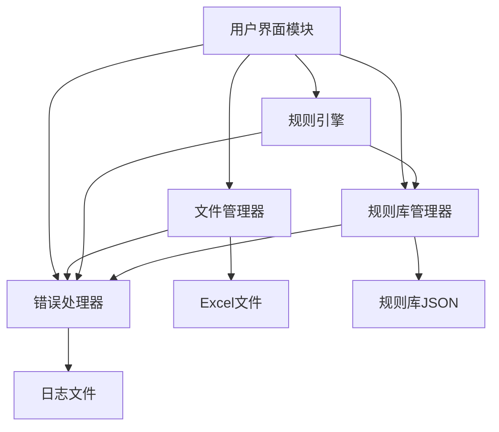
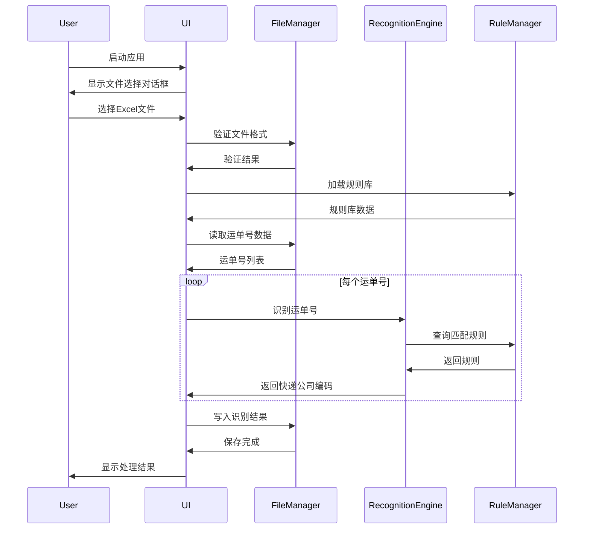

# 设计文档

## 概述

快递单号自动识别填充工具是一个基于Python的桌面应用程序，用于自动识别Excel模板中的快递运单号并填充对应的快递公司编码。系统采用模块化设计，将文件处理、规则匹配、用户界面等功能分离，确保代码的可维护性和可扩展性。

### 核心功能

1. **文件处理模块**: 负责Excel文件的读取、验证和写入
2. **规则引擎模块**: 负责运单号的识别和匹配
3. **规则库管理模块**: 负责规则库的加载、生成和维护
4. **用户界面模块**: 负责与用户的交互和反馈
5. **错误处理模块**: 负责统一的错误处理和日志记录

### 技术栈

- **编程语言**: Python 3.8+
- **Excel处理**: openpyxl (支持.xlsx) 和 xlrd (支持.xls)
- **GUI框架**: tkinter (Python标准库)
- **规则存储**: JSON格式
- **正则表达式**: re模块

## 架构

### 系统架构图



### 模块职责

#### 1. 用户界面模块 (UIManager)
- 显示文件选择对话框
- 显示处理进度
- 显示结果统计和错误消息
- 协调各模块的执行流程

#### 2. 文件管理器 (FileManager)
- Excel文件的打开和关闭
- 模板格式验证
- 工作表数据读取
- 数据写入和文件保存

#### 3. 规则引擎 (RecognitionEngine)
- 运单号格式匹配
- 快递公司识别
- 规则优先级处理

#### 4. 规则库管理器 (RuleManager)
- 规则库文件的加载和保存
- 初始规则库生成
- 规则数据结构管理

#### 5. 错误处理器 (ErrorHandler)
- 统一的异常处理
- 错误日志记录
- 用户友好的错误消息

### 数据流



## 组件和接口

### 1. FileManager 类

```python
class FileManager:
    """Excel文件管理器"""
    
    def __init__(self, file_path: str):
        """初始化文件管理器
        
        Args:
            file_path: Excel文件路径
        """
        pass
    
    def validate_template(self) -> Tuple[bool, str]:
        """验证Excel模板格式
        
        Returns:
            (是否有效, 错误消息)
        """
        pass
    
    def read_tracking_numbers(self) -> List[Tuple[int, str]]:
        """读取运单号数据
        
        Returns:
            [(行号, 运单号), ...]
        """
        pass
    
    def read_courier_list(self) -> List[str]:
        """读取快递公司列表
        
        Returns:
            快递公司名称列表
        """
        pass
    
    def write_courier_codes(self, results: Dict[int, str]) -> None:
        """写入快递公司编码
        
        Args:
            results: {行号: 快递公司编码}
        """
        pass
    
    def save(self) -> None:
        """保存Excel文件"""
        pass
    
    def close(self) -> None:
        """关闭Excel文件"""
        pass
```

### 2. RecognitionEngine 类

```python
class RecognitionEngine:
    """运单号识别引擎"""
    
    def __init__(self, rule_manager: RuleManager):
        """初始化识别引擎
        
        Args:
            rule_manager: 规则库管理器实例
        """
        pass
    
    def recognize(self, tracking_number: str) -> Optional[str]:
        """识别运单号对应的快递公司编码
        
        Args:
            tracking_number: 运单号
            
        Returns:
            快递公司编码，未识别返回None
        """
        pass
    
    def batch_recognize(self, tracking_numbers: List[str]) -> List[Optional[str]]:
        """批量识别运单号
        
        Args:
            tracking_numbers: 运单号列表
            
        Returns:
            快递公司编码列表
        """
        pass
```

### 3. RuleManager 类

```python
class RuleManager:
    """规则库管理器"""
    
    def __init__(self, rule_file_path: str):
        """初始化规则库管理器
        
        Args:
            rule_file_path: 规则库文件路径
        """
        pass
    
    def load_rules(self) -> bool:
        """加载规则库
        
        Returns:
            是否加载成功
        """
        pass
    
    def generate_default_rules(self, courier_names: List[str]) -> None:
        """生成默认规则库
        
        Args:
            courier_names: 快递公司名称列表
        """
        pass
    
    def get_rules(self) -> List[Dict]:
        """获取所有规则
        
        Returns:
            规则列表，按优先级排序
        """
        pass
    
    def save_rules(self) -> None:
        """保存规则库到文件"""
        pass
```

### 4. UIManager 类

```python
class UIManager:
    """用户界面管理器"""
    
    def __init__(self):
        """初始化UI管理器"""
        pass
    
    def select_file(self) -> Optional[str]:
        """显示文件选择对话框
        
        Returns:
            选择的文件路径，取消返回None
        """
        pass
    
    def show_progress(self, current: int, total: int) -> None:
        """显示处理进度
        
        Args:
            current: 当前处理数量
            total: 总数量
        """
        pass
    
    def show_result(self, total: int, recognized: int, unrecognized: int, file_path: str) -> None:
        """显示处理结果
        
        Args:
            total: 总运单号数量
            recognized: 识别成功数量
            unrecognized: 未识别数量
            file_path: 文件保存路径
        """
        pass
    
    def show_error(self, message: str) -> None:
        """显示错误消息
        
        Args:
            message: 错误消息
        """
        pass
```

### 5. ErrorHandler 类

```python
class ErrorHandler:
    """错误处理器"""
    
    @staticmethod
    def handle_exception(exception: Exception) -> str:
        """处理异常并返回用户友好的错误消息
        
        Args:
            exception: 异常对象
            
        Returns:
            用户友好的错误消息
        """
        pass
    
    @staticmethod
    def log_error(message: str, exception: Optional[Exception] = None) -> None:
        """记录错误日志
        
        Args:
            message: 错误消息
            exception: 异常对象（可选）
        """
        pass
```

## 数据模型

### 规则库数据结构

```json
{
  "version": "1.0",
  "rules": [
    {
      "courier_name": "顺丰速运",
      "courier_code": "SF",
      "patterns": [
        "^[A-Za-z0-9-]{4,35}$"
      ],
      "priority": 1,
      "description": "顺丰速运：4-35位字母数字组合"
    },
    {
      "courier_name": "圆通速递",
      "courier_code": "YTO",
      "patterns": [
        "^[A-Za-z0-9]{2}[0-9]{10}$",
        "^[A-Za-z0-9]{2}[0-9]{8}$",
        "^[6-9][0-9]{17}$",
        "^[DD]{2}[8-9][0-9]{15}$",
        "^[Y][0-9]{12}$"
      ],
      "priority": 2,
      "description": "圆通速递：多种格式组合"
    },
    {
      "courier_name": "中通快递",
      "courier_code": "ZTO",
      "patterns": [
        "^((768|765|778|828|618|680|518|528|688|010|880|660|805|988|628|205|717|718|728|761|762|763|701|757|719|751|358|100|200|118|128|689|738|359|779|852)[0-9]{9})$",
        "^((5711|2008|7380|1180|2009|2013|2010|1000|1010)[0-9]{8})$",
        "^((8010|8021|8831|8013)[0-9]{6})$",
        "^((1111|90|36|11|50|53|37|39|91|93|94|95|96|98)[0-9]{10})$"
      ],
      "priority": 3,
      "description": "中通快递：多种前缀+数字组合"
    },
    {
      "courier_name": "申通快递",
      "courier_code": "STO",
      "patterns": [
        "^(888|588|688|468|568|668|768|868|968)[0-9]{9}$",
        "^(11|22)[0-9]{10}$",
        "^(STO)[0-9]{10}$",
        "^(37|33|11|22|44|55|66|77|88|99)[0-9]{11}$",
        "^(4)[0-9]{11}$"
      ],
      "priority": 4,
      "description": "申通快递：特定前缀+数字组合"
    },
    {
      "courier_name": "韵达快递",
      "courier_code": "YUNDA",
      "patterns": [
        "^(10|11|12|13|14|15|16|17|19|18|50|55|58|80|88|66|31|77|39)[0-9]{11}$",
        "^[0-9]{13}$"
      ],
      "priority": 5,
      "description": "韵达快递：特定前缀+11位数字或13位数字"
    },
    {
      "courier_name": "极兔速递",
      "courier_code": "JT",
      "patterns": [
        "^JT[0-9]{13}$",
        "^[0-9]{13}$",
        "^JT[A-Z0-9]{10,15}$"
      ],
      "priority": 6,
      "description": "极兔速递：JT前缀+数字或纯数字"
    },
    {
      "courier_name": "京东快递",
      "courier_code": "JD",
      "patterns": [
        "^JD[0-9]{18}$",
        "^[0-9]{15}$",
        "^[0-9]{18}$",
        "^JDX[0-9]{12}$"
      ],
      "priority": 7,
      "description": "京东快递：JD前缀+数字或纯数字"
    },
    {
      "courier_name": "邮政EMS",
      "courier_code": "EMS",
      "patterns": [
        "^[A-Z]{2}[0-9]{9}[A-Z]{2}$",
        "^(10|11)[0-9]{11}$",
        "^(50|51)[0-9]{11}$",
        "^(95|97)[0-9]{11}$"
      ],
      "priority": 8,
      "description": "邮政EMS：2位字母+9位数字+2位字母或特定前缀+11位数字"
    },
    {
      "courier_name": "邮政快递包裹",
      "courier_code": "POSTB",
      "patterns": [
        "^([GA]|[KQ]|[PH]){2}[0-9]{9}([2-5][0-9]|[1][1-9]|[6][0-5])$",
        "^[99]{2}[0-9]{11}$",
        "^[96]{2}[0-9]{11}$",
        "^[98]{2}[0-9]{11}$"
      ],
      "priority": 9,
      "description": "邮政快递包裹：特定字母组合+数字"
    },
    {
      "courier_name": "安能物流",
      "courier_code": "ANE",
      "patterns": [
        "^[0-9]{15}$",
        "^AN[0-9]{13}$",
        "^[0-9]{12}$"
      ],
      "priority": 10,
      "description": "安能物流：15位数字或AN前缀+13位数字"
    },
    {
      "courier_name": "德邦快递",
      "courier_code": "DBKD",
      "patterns": [
        "^[5789]\\d{9}$"
      ],
      "priority": 11,
      "description": "德邦快递：5/7/8/9开头+9位数字"
    },
    {
      "courier_name": "百世快运",
      "courier_code": "HTKY",
      "patterns": [
        "^((A|B|D|E)[0-9]{12})$",
        "^(BXA[0-9]{10})$",
        "^(K8[0-9]{11})$",
        "^(02[0-9]{11})$",
        "^(000[0-9]{10})$",
        "^(C0000[0-9]{8})$"
      ],
      "priority": 12,
      "description": "百世快递：字母前缀+数字组合"
    },
    {
      "courier_name": "中通快运",
      "courier_code": "ZTO_KY",
      "patterns": [
        "^[0-9]{12}$",
        "^ZTO[0-9]{10}$"
      ],
      "priority": 13,
      "description": "中通快运：12位数字或ZTO前缀+10位数字"
    }
  ]
}
```

### 规则对象模型

```python
@dataclass
class CourierRule:
    """快递公司规则"""
    courier_name: str          # 快递公司名称
    courier_code: str          # 快递公司编码
    patterns: List[str]        # 正则表达式模式列表
    priority: int              # 优先级（数字越小优先级越高）
    description: str           # 规则描述
    
    def matches(self, tracking_number: str) -> bool:
        """检查运单号是否匹配此规则
        
        Args:
            tracking_number: 运单号
            
        Returns:
            是否匹配
        """
        pass
```

### Excel模板结构

#### 第一个工作表（订单数据）

| 订单编号 | 物流公司 | 运单号 |
|---------|---------|--------|
| ORD001  |         | SF1234567890 |
| ORD002  |         | 1234567890123 |

#### 第二个工作表（快递公司列表）

| 快递公司名称 |
|------------|
| 顺丰速运    |
| 中通快递    |
| 圆通速递    |
| 申通快递    |
| 韵达快递    |

## 算法设计

### 运单号识别算法

```python
def recognize_tracking_number(tracking_number: str, rules: List[CourierRule]) -> Optional[str]:
    """识别运单号对应的快递公司编码
    
    算法流程：
    1. 清理运单号（去除空白字符）
    2. 按优先级排序规则
    3. 遍历规则，使用正则表达式匹配
    4. 返回第一个匹配的快递公司编码
    5. 如果没有匹配，返回None
    
    Args:
        tracking_number: 运单号
        rules: 规则列表
        
    Returns:
        快递公司编码或None
    """
    # 清理运单号
    cleaned_number = tracking_number.strip()
    
    if not cleaned_number:
        return None
    
    # 按优先级排序
    sorted_rules = sorted(rules, key=lambda r: r.priority)
    
    # 遍历规则进行匹配
    for rule in sorted_rules:
        for pattern in rule.patterns:
            if re.match(pattern, cleaned_number):
                return rule.courier_code
    
    return None
```

### 模板验证算法

```python
def validate_template(workbook) -> Tuple[bool, str]:
    """验证Excel模板格式
    
    算法流程：
    1. 检查工作表数量（至少2个）
    2. 获取第一个工作表的表头
    3. 使用模糊匹配检查必需列（订单编号、物流公司、运单号）
    4. 检查第二个工作表是否包含数据
    5. 返回验证结果
    
    Args:
        workbook: Excel工作簿对象
        
    Returns:
        (是否有效, 错误消息)
    """
    # 检查工作表数量
    if len(workbook.worksheets) < 2:
        return False, "Excel文件必须包含至少2个工作表"
    
    # 获取第一个工作表
    order_sheet = workbook.worksheets[0]
    header_row = list(order_sheet.iter_rows(min_row=1, max_row=1, values_only=True))[0]
    
    # 模糊匹配必需列
    required_keywords = ["订单编号", "物流公司", "运单号"]
    found_columns = {keyword: False for keyword in required_keywords}
    
    for cell_value in header_row:
        if cell_value:
            cell_str = str(cell_value)
            for keyword in required_keywords:
                if keyword in cell_str:
                    found_columns[keyword] = True
    
    # 检查是否所有必需列都找到
    missing_columns = [k for k, v in found_columns.items() if not v]
    if missing_columns:
        return False, f"缺少必需列: {', '.join(missing_columns)}"
    
    # 检查第二个工作表
    courier_sheet = workbook.worksheets[1]
    if courier_sheet.max_row < 2:  # 至少有表头和一行数据
        return False, "第二个工作表必须包含快递公司列表"
    
    return True, ""
```

### 规则库初始化算法

```python
def generate_default_rules(courier_names: List[str]) -> List[CourierRule]:
    """生成默认规则库
    
    算法流程：
    1. 定义常见快递公司的运单号规则映射
    2. 遍历快递公司名称列表
    3. 根据名称匹配预定义规则
    4. 为未匹配的快递公司生成通用规则
    5. 返回规则列表
    
    Args:
        courier_names: 快递公司名称列表
        
    Returns:
        规则列表
    """
    # 预定义规则映射（基于淘宝开放平台2018年规则）
    predefined_rules = {
        "顺丰": {
            "code": "SF",
            "patterns": ["^[A-Za-z0-9-]{4,35}$"],
            "priority": 1,
            "description": "顺丰速运：4-35位字母数字组合"
        },
        "圆通": {
            "code": "YTO", 
            "patterns": ["^[A-Za-z0-9]{2}[0-9]{10}$", "^[A-Za-z0-9]{2}[0-9]{8}$", "^[6-9][0-9]{17}$", "^[DD]{2}[8-9][0-9]{15}$", "^[Y][0-9]{12}$"],
            "priority": 2,
            "description": "圆通速递：多种格式组合"
        },
        "中通": {
            "code": "ZTO",
            "patterns": ["^((768|765|778|828|618|680|518|528|688|010|880|660|805|988|628|205|717|718|728|761|762|763|701|757|719|751|358|100|200|118|128|689|738|359|779|852)[0-9]{9})$", "^((5711|2008|7380|1180|2009|2013|2010|1000|1010)[0-9]{8})$", "^((8010|8021|8831|8013)[0-9]{6})$", "^((1111|90|36|11|50|53|37|39|91|93|94|95|96|98)[0-9]{10})$"],
            "priority": 3,
            "description": "中通快递：多种前缀+数字组合"
        },
        "申通": {
            "code": "STO",
            "patterns": ["^(888|588|688|468|568|668|768|868|968)[0-9]{9}$", "^(11|22)[0-9]{10}$", "^(STO)[0-9]{10}$", "^(37|33|11|22|44|55|66|77|88|99)[0-9]{11}$", "^(4)[0-9]{11}$"],
            "priority": 4,
            "description": "申通快递：特定前缀+数字组合"
        },
        "韵达": {
            "code": "YUNDA",
            "patterns": ["^(10|11|12|13|14|15|16|17|19|18|50|55|58|80|88|66|31|77|39)[0-9]{11}$", "^[0-9]{13}$"],
            "priority": 5,
            "description": "韵达快递：特定前缀+11位数字或13位数字"
        },
        "极兔": {
            "code": "JT",
            "patterns": ["^JT[0-9]{13}$", "^[0-9]{13}$", "^JT[A-Z0-9]{10,15}$"],
            "priority": 6,
            "description": "极兔速递：JT前缀+数字或纯数字"
        },
        "京东": {
            "code": "JD",
            "patterns": ["^JD[0-9]{18}$", "^[0-9]{15}$", "^[0-9]{18}$", "^JDX[0-9]{12}$"],
            "priority": 7,
            "description": "京东快递：JD前缀+数字或纯数字"
        },
        "EMS": {
            "code": "EMS",
            "patterns": ["^[A-Z]{2}[0-9]{9}[A-Z]{2}$", "^(10|11)[0-9]{11}$", "^(50|51)[0-9]{11}$", "^(95|97)[0-9]{11}$"],
            "priority": 8,
            "description": "邮政EMS：2位字母+9位数字+2位字母或特定前缀+11位数字"
        },
        "邮政": {
            "code": "POSTB",
            "patterns": ["^([GA]|[KQ]|[PH]){2}[0-9]{9}([2-5][0-9]|[1][1-9]|[6][0-5])$", "^[99]{2}[0-9]{11}$", "^[96]{2}[0-9]{11}$", "^[98]{2}[0-9]{11}$"],
            "priority": 9,
            "description": "邮政快递包裹：特定字母组合+数字"
        },
        "安能": {
            "code": "ANE",
            "patterns": ["^[0-9]{15}$", "^AN[0-9]{13}$", "^[0-9]{12}$"],
            "priority": 10,
            "description": "安能物流：15位数字或AN前缀+13位数字"
        },
        "德邦": {
            "code": "DBKD",
            "patterns": ["^[5789]\\d{9}$"],
            "priority": 11,
            "description": "德邦快递：5/7/8/9开头+9位数字"
        },
        "百世": {
            "code": "HTKY",
            "patterns": ["^((A|B|D|E)[0-9]{12})$", "^(BXA[0-9]{10})$", "^(K8[0-9]{11})$", "^(02[0-9]{11})$", "^(000[0-9]{10})$", "^(C0000[0-9]{8})$"],
            "priority": 12,
            "description": "百世快递：字母前缀+数字组合"
        }
    }
    
    rules = []
    priority_counter = len(predefined_rules) + 1
    
    for courier_name in courier_names:
        # 查找匹配的预定义规则
        matched_rule = None
        for key, rule_data in predefined_rules.items():
            if key in courier_name:
                matched_rule = rule_data
                break
        
        if matched_rule:
            rules.append(CourierRule(
                courier_name=courier_name,
                courier_code=matched_rule["code"],
                patterns=matched_rule["patterns"],
                priority=matched_rule["priority"],
                description=matched_rule["description"]
            ))
        else:
            # 生成通用规则
            code = courier_name[:3].upper() if len(courier_name) >= 3 else courier_name.upper()
            rules.append(CourierRule(
                courier_name=courier_name,
                courier_code=code,
                patterns=["^[0-9A-Za-z]{10,20}$"],  # 通用：10-20位字母数字
                priority=priority_counter,
                description=f"{courier_name}通用运单号规则（10-20位字母数字）"
            ))
            priority_counter += 1
    
    return rules
```

